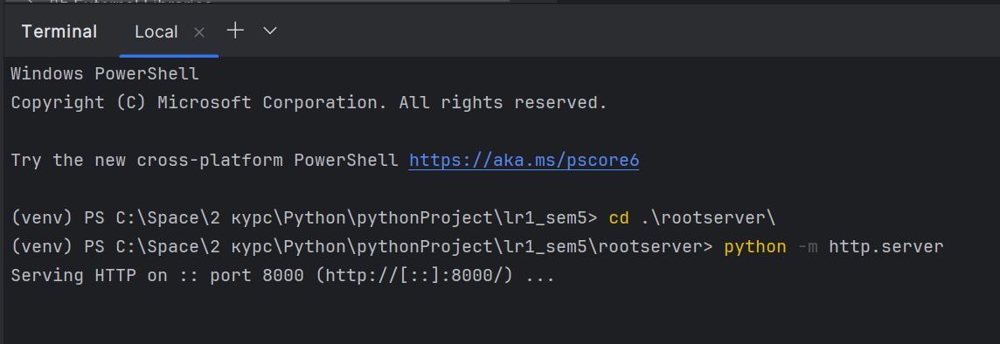
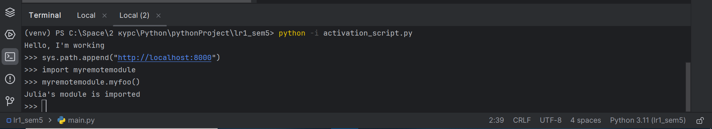
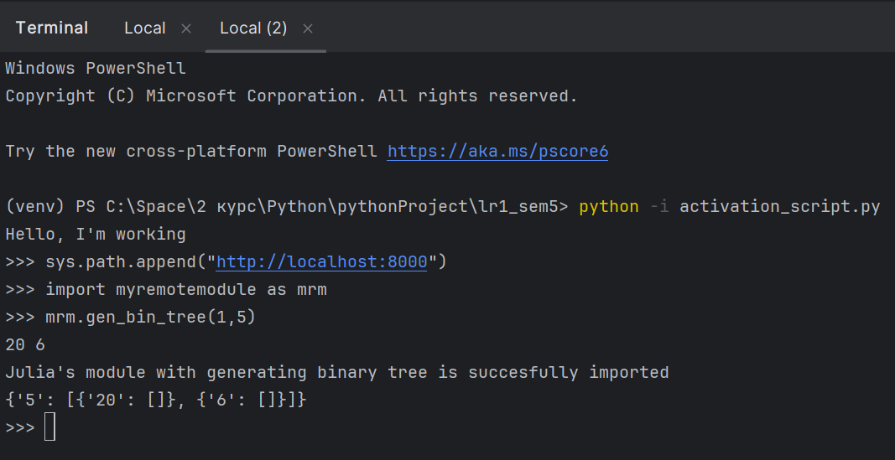

# Лабораторная работа №1. Реализация удаленного импорта
## Выполнила: Гиниятуллина Юлия Сергеевна

Код расположен локально на компьютере.
По шагам:
1) Был создан файл myremotemodule.py в папке rootserver
2) В нем был размещен код:
```
def myfoo():
    author = "Julia" # Здесь обознаться своё имя (авторство модуля)
    print(f"{author}'s module is imported")
```
3) Был создан файл activation_script.py с содержимым функций url_hook и классов URLLoader, URLFinder
4) Далее, чтобы продемонстрировать работу импорта из удаленного каталога, я запустила сервер http из директории rootserver:


5) После этого мы запускаем файл activation_script.py, после чего выполняем код:
```
sys.path.append("http://localhost:8000")
```
Далее спокойно делаем импорт модуля и проверяем, что он работает:


6) Затем я переписала содержимое файла myremotemodule.py, превратив его в модуль, который содержит в себе функцию генерации бинарного дерева. Исходный код модуля:
```
def gen_bin_tree(height: int, root: int):
    tree = {str(root): []}
    left_func = lambda root: root * 4
    right_func = lambda root: root + 1

    if ((abs(height) != height) or (abs(root) != root)):
        return "Height or root must be a non-negative integer"
    elif type(height) != int or type(root) != int:
        return "Height or root must be an integer value"
    else:
        if (height == 0):
            return tree
        else:
            l_l = left_func(root)
            r_l = right_func(root)
            print(l_l, r_l)
            a = gen_bin_tree(root=l_l, height=height - 1)
            tree[str(root)].append(a)
            b = gen_bin_tree(root=r_l, height=height - 1)
            tree[str(root)].append(b)
            print("Julia's module with generating binary tree is succesfully imported")
        return tree 
```
Затем я так же запустила activation_script.py и импортировала модуль:


7) Был выполнен удаленный импорт с помощью хостинга GitHub. Ссылка на репозиторий с файлом модуля: https://github.com/julia1gin/testremotemodule
